![Am I responsive screenshot]

### WWAMI (What Word Am I?) is an exciting new word game where the player has to guess a random word to score points. 

Visit the deployed site [here](https://cleg83.github.io/what-word-am-i/)

## CONTENTS

* [WWAMI](#WWAMI)

* [Rationale](#rationale)
  * [Project Introduction](#project-introduction)
  * [Motivation and Inspiration](#motivation-and-inspiration)
  * [Background Information](#background-information)
  * [Project Scope and Limitations](#project-scope-and-limitations)
  * [Problem Statement](#problem-statement)
  * [Proposed Solution](#proposed-solution)
  * [Benefits and Advantages](#benefits-and-advantages)
  * [Future Versions](#future-versions)
  * [Summary](#summary)

* [User Stories](#user-stories)

* [Design](#design)
  * [Colour Scheme](#colour-scheme)
  * [Typography](#typography)
  * [Wireframes](#wireframes)

* [Features](#features)
  * [Favicon](#favicon)
  * [The Navbar](#the-navbar)
  * [The Welcome Page](#the-welcome-page)
  * [The Game Page](#the-game-page)
  * [Generating a random word](#generating-a-random-word)
  * [Generating Hints](#generating-hints)
    * [Fetching Synonyms](#fetching-synonyms)
    * [Fetching Definitions](#fetching-definitions)
    * [Fetching Rhyming Words](#fetching-rhyming-words)
    * [Hint Error Handling](#hint-error-handling)
  * [The Hint Button](#the-hint-button)
  * [Submitting A Guess](#submitting-a-guess)
  * [The Pass Button](#the-pass-button)
  * [Emailing The Results](#emailing-the-results)
* [Accessibility](#accessibility)

* [Technologies](#technologies)
  * [Languages](#languages)
  * [Frameworks, Libraries and Programs](#frameworks-libraries-and-programs)

* [Deployment & Development](#deployment--development)
  * [Deployment](#deployment)
  * [Local Development](#local-development)
    * [Extensions required](#extensions-required)
    * [How to Fork](#how-to-fork)
    * [How to Clone](#how-to-clone)

* [Testing](#testing)
  * [W3C](#W3C)
  * [Lighthouse](#Lighthouse)
  * [Jest](#jest)
  * [JS-Lint](#js-lint)
  
* [Credits](#credits)
  * [External code](#external-code)
  * [Media](#media)

---

## Rationale

### Project introduction

"WWAMI" (What Word Am I?) is an engaging and educational word-guessing game designed for users of all ages. The primary goal of this project is to provide an entertaining and challenging platform where players can test and improve their vocabulary skills through a series of word-guessing rounds with optional hints.

The primary of objective of this project was to create an interactive, easily-navigable, fun and educational word guessing game using HTML, CSS & JavaScript.

### Motivation and Inspiration

The motivation behind creating WWAMI stems from the desire to offer a fun and interactive way for people to enhance their language skills. In today's digital age, finding enjoyable and educational content is crucial. This project aims to fill that niche by combining elements of traditional word games with modern web-based interactivity. 

The aim was to create a word guessing game that provides a new, enjoyable but challenging interactive experience and offers features other word guessing games do not (mainly the ability to show hints for the word if needed).

I would be lying if I said the main inspiration for WWAMI wasn't an incredibly popular daily word game (that may or may not rhyme with curdle), an online word guessing game that seemed to take the world by storm (at least for a good few months anyway). 

### Background Information

Word games have always been a popular pastime for the linguistically minded for both recreational and educational purposes. However, many existing digital word games lack engaging interfaces or adaptive difficulty levels that keep users motivated. Recognising the potential to innovate in this space, WWAMI was conceived to offer a fresh take on word games by leveraging web technologies to create a responsive and dynamic user experience.

WWAMI took around 6 weeks to build and the bulk of the time was spent on navigation and letter input. Due to the game layout being simple and text input based, I wanted the player to not have to think about navigating between tiles.

What I thought would be a simple project to build ended up presenting me with problems I'd not yet considered and the solutions to these problems were (largely) new territories for me.

Thankfully (at its best), the internet is a wonderfully helpful place and hours of scouring Stack Overflow, W3C, MDN & YouTube (special shout-out to the WebDev Simplified channel) steered me in the right direction. 

N.B. The commit history for this project belies the amount of time I actually spent working on it. I would say it's about 6 weeks of work that was committed regularly to a gitHub repo but due to exposing the API key (which I have since discovered is somewhat impossible without any server-side programming), I panicked and deleted that repo. Then in a rather rushed manner, I committed everything to the new repo but was careful to still (try) and give a fairly accurate snapshot of the order in which the project was built. 

### Project Scope and Limitations

The scope of the project includes the development of the web-based game with the aforementioned features, focusing on usability and accessibility. Known limitations include:

* Word Database: The game relies on external APIs for word data, which can have limitations in availability and accuracy. 

* Browser Compatibility: While efforts have been made to ensure cross-browser compatibility, some features may not work optimally on all browsers.

### Problem Statement

The primary problem that WWAMI aims to address is the lack of engaging, educational word games that are both challenging and accessible. Many word games either become repetitive quickly or do not adequately cater to users with different skill levels. Additionally, there is a need for games that can be easily played within a web browser without the need for extensive setup or downloads.

My main issue with game I play daily is the tyranny of choice. By this, I mean a series of blank tiles with no context or guidance can inhibit some players from getting started (there's simply too much choice with where to start). WWAMI aims to address this by offering the player hints.

### Proposed Solution

WWAMI proposes a web-based word-guessing game with the following key features:

* Hint System: Players can choose to receive hints at the cost of reduced points, making the game adaptable to different skill levels.

* Interactive Gameplay: The game provides a smooth and interactive experience with features like editable letter divs, automatic focus shifts, and real-time score updates.

* Scoring Mechanism: A scoring system that rewards players based on their ability to guess the word with fewer hints, promoting repeated play and improvement.

* Accessibility Features: The game includes features designed to be accessible to visually impaired users, ensuring inclusivity.

### Benefits and Advantages

WWAMI offers several advantages over existing word games:

* Educational Value: Enhances vocabulary and cognitive skills in a fun, interactive manner.

* User Engagement: The hint system and adaptive difficulty levels keep players engaged longer.

* Accessibility: Designed with accessibility in mind, making it playable by a broader audience.

* Ease of Use: Runs directly in web browsers without the need for additional installations or plugins.

### Future Versions

Ideas for future enhancements to WWAMI include:

* Expanded Word Lists: Incorporating more extensive and diverse word lists to keep the game challenging.

* Multiplayer Mode: Allowing players to compete against friends or other users online.

* Expanded dictionary integration to allow WWAMI to be played in other languages.

* Replace alerts and confirms with modals for a more modern user experience. 

* Additional Accessibility Features: Continuous improvements to make the game more accessible to users with various disabilities.

### Summary

WWAMI is an innovative and educational word-guessing game designed to provide a fun and challenging experience for users while enhancing their vocabulary skills. 

By addressing the need for engaging and accessible word games, WWAMI stands out with its interactive gameplay, hint system, and focus on inclusivity. 

The project not only offers immediate benefits to players but also has the potential for future enhancements that will keep it relevant and enjoyable.

- - - 

## User Stories

#### User Story 1: 

As a first time visitor, I want to quickly be able to understand the game objective and understand how to play the game, so I can decide whether or not I wish to play.

#### User Story 2: 

As a first time player, I want to easily identify and navigate between the game components, so that I can enjoy playing the game without being hindered.

#### User Story 3: 

As a language aficionado, I want to be able to guess the word without hints, so that I can score the maximum amount of points. 

#### User Story 4: 

As a casual player, I want to be able to use hints when needed, so that I can enjoy playing the game with the goal not being to achieve maximum points. 

#### User Story 5:

As a returning player, I want to be able to beat my previous score, so that I can challenge myself.

- - -

## Design

### Colour Scheme

I wanted to keep the color scheme simple and only choose background colours that contrast well with both black and white (or off white to be more precise). The letter tiles in the game make use of both black and white (see below).

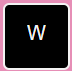

The default colour is light pink and the random colors the game cycles through are all soft, pastel shades.

 

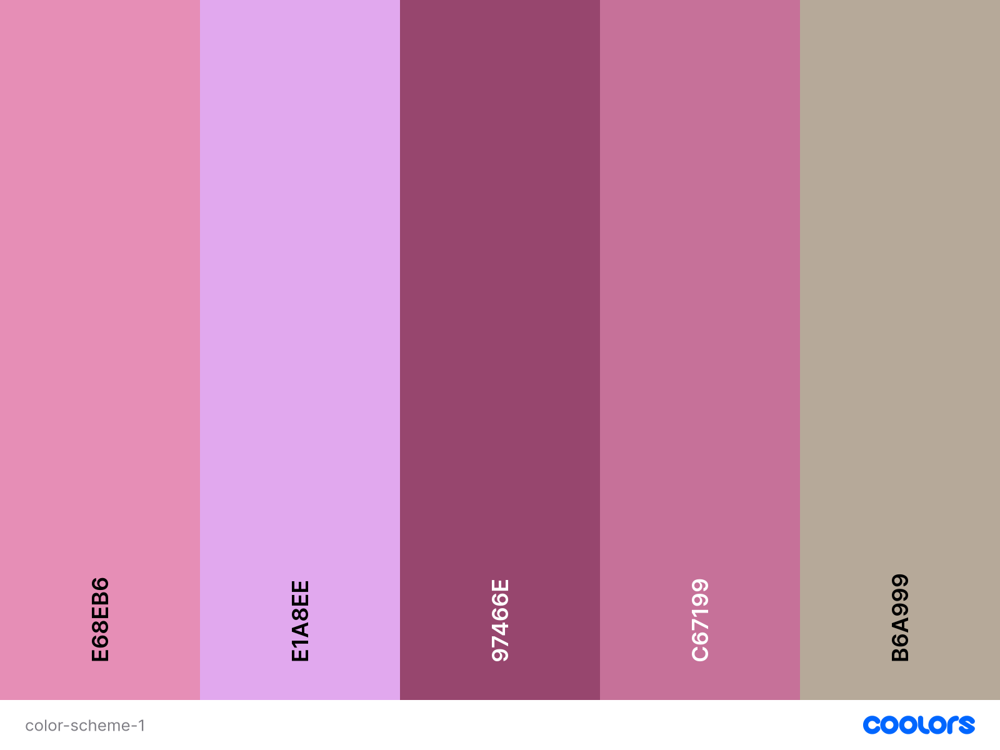

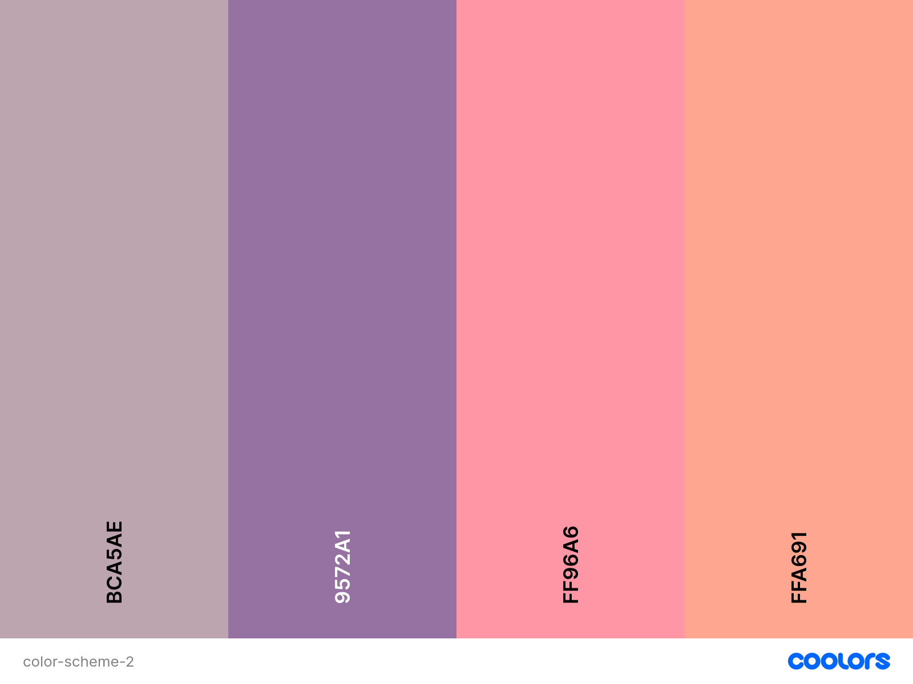

 

### Typography

A clear font is the primary requirement for a word game font so I have opted to use two Google Fonts that complement each other well. 

* [Nunito](https://fonts.google.com/specimen/Nunito) for the header and modal font.

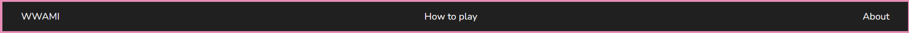

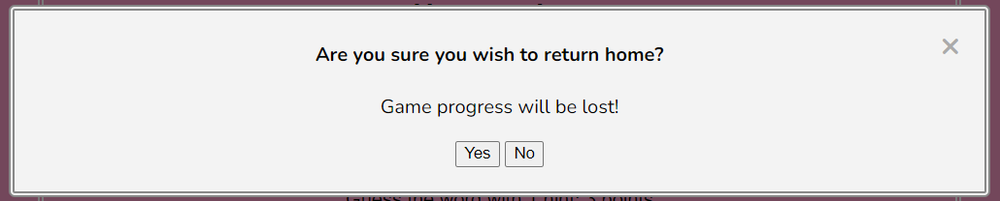

 

* [Roboto](https://fonts.google.com/specimen/Roboto) for the welcome page content and game page"

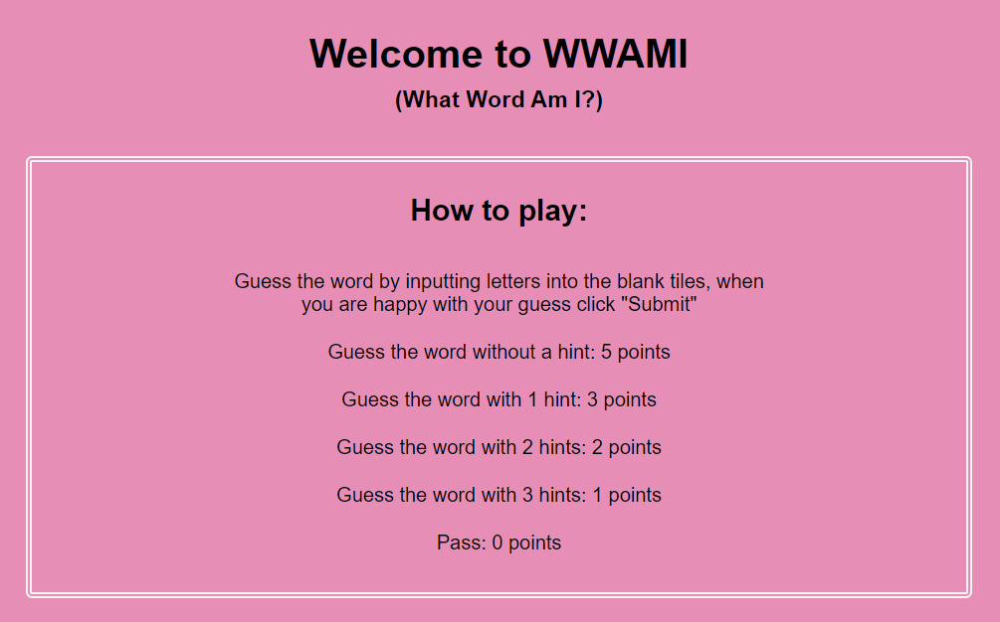

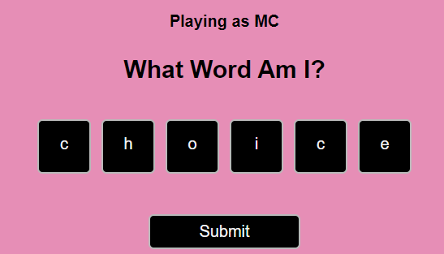

### Wireframes

- - - 

## Features

### Favicon

For WWAMI, I wanted to favicon to be a game tile with the default-color just showing in the background:

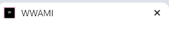

### The Navbar

The navbar is pretty straightforward as the game page itself takes care of a lot of the navigation. 

The navbar contains:
  * WWAMI - Which is link to the welcome page (confirming if the user wants to return home and lose game progress). 

  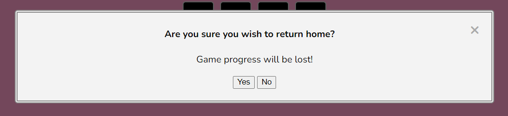

  * How To Play - Which is a link to display the game instructions.

  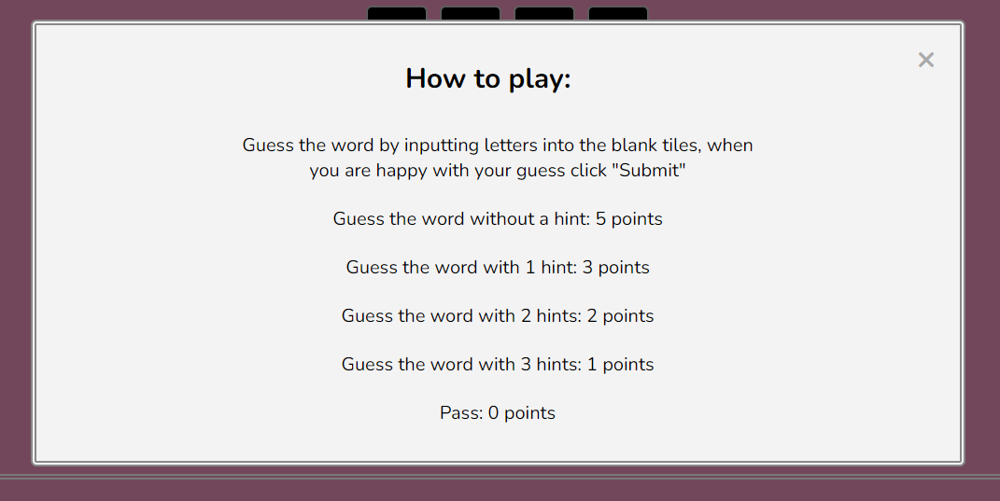

  * About - Which displays information about the game and the technologies used to build it.

  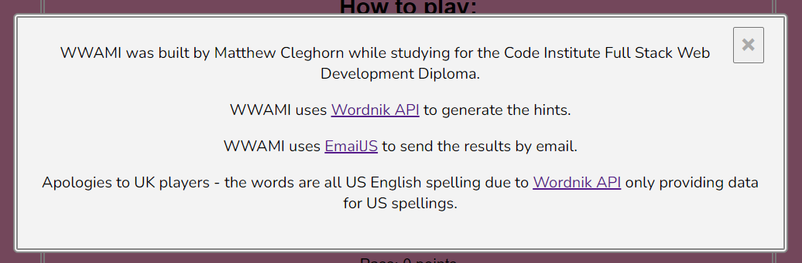

### The Welcome Page

I wanted the landing page for WWAMI to provide the player with clear instructions about how to play and how the point scoring system works. As you can see below, the layout is uncluttered and the instructions are clear.

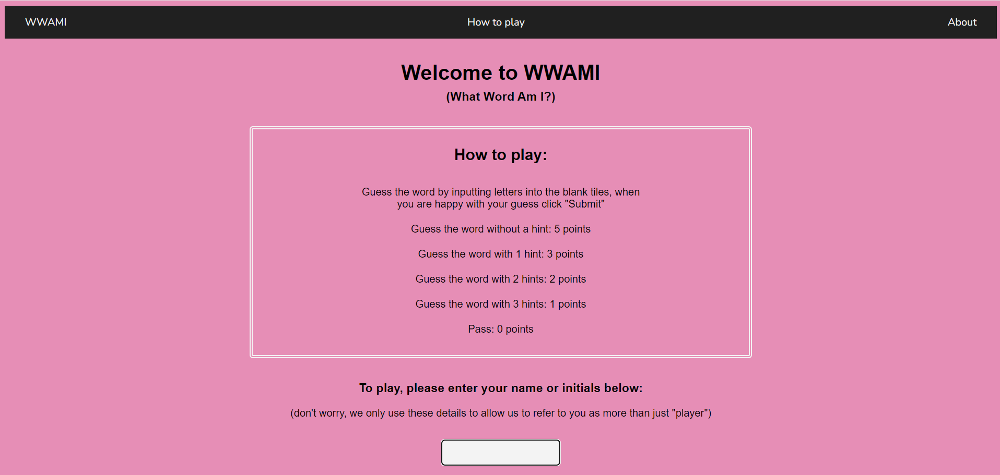

The input field for the player to input their name or initials is in focus when the page loads so the player is able to input their information without having to click anywhere first.

When the player starts typing, the GO! button appears and on click (or by pressing enter) the game page is launched.

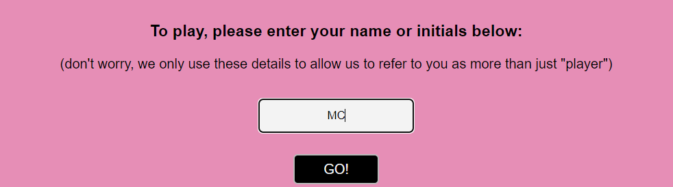

### The Game Page

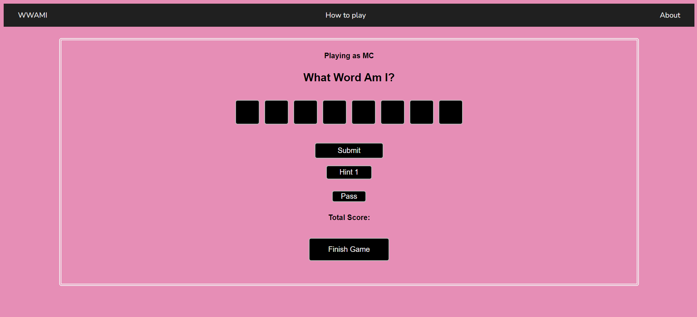

The game page displays blank letter divs as tiles that the player types letters in. The word the player has to guess is generated randomly from an array of words.

I wanted the focus to be on the first blank tile when the game loads so that the player can immediately start playing. As well as the cursor automatically being the first tile, the border also changes colour when in focus (see below).

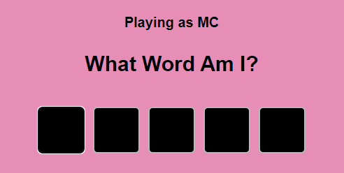

Once the player has typed a letter, the focus moves to the next blank tile but the player is able to navigate freely between the tiles with arrow keys or by touching a blank tile on a touch screen device. 

The backspace key also acts as a secondary navigational tool by clearing the letter in the selected tile and then moving focus to the previous tile.

When the focus is on either a tile or the submit button, the enter key will allow the player to submit a guess.

The game page also allows the player to generate up to three hints (more on that functionality can be found in the next few sections). With each hint shown, the score the player can achieve is reduced. 

The player can choose to pass the round and score 0 points and they can also choose to finish the game at any time.

### Generating a random word

The word the player has to guess is a random word generated from an array of around 1800 words stored in the [word-list.js](#assets/js/word-list.js) file.

This is achieved through selecting a random index from the array in the launchGame function.

The correct number of blank tiles (letter divs) are then generated and displayed based on the number of letters in the word.

## Generating Hints

All hints are generated by API calls to [Wordnik API](https://developer.wordnik.com/). 

[Wordnik API](https://developer.wordnik.com/) is a fantastic resource for obtaining data for a specified word.

For WWAMI, I needed to fetch the synonyms, the definition and rhyming words for the game word the player has to guess.

The synonyms and rhymes are returned as an array of up to 100 words so I had to shuffle these and then select 10 words from the array. I found the Fisher-Yates algorithm (see below) to shuffle arrays and this did exactly what I needed it to (and probably saved me hours of bashing my head against a wall).

    function shuffleArray(array) {
      for (let i = array.length - 1; i > 0; i--) {
        let j = Math.floor(Math.random() * (i + 1));
        [array[i], array[j]] = [array[j], array[i]];
      }
      return array;
    }

 I could then slice the first 10 words from the array with relative ease.

### Fetching synonyms

The first hint the player can choose to display are the synonyms of the game word.

Wordnik API returns the data in the below format when making the call:

    [
      {
        "relationshipType": "synonym",
        "words": [ ]
      }
    ]

From this I had to extract the "words" array so I could manipulate the data with the method outlined above.

The synonyms are then displayed as a comma separated string with the first letter of the first word capitalised and because it's a word game and details are important, it ends with a full-stop.

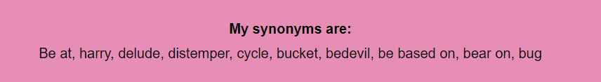

### Fetching definitions

This was less complicated than fetching the synonyms and rhyming words because you can limit the number of responses the API returns to only one definition in the URL:

    let hintTwo = `${word}/definitions?limit=1&includeRelated=false

From this one result, I only had to extract the "text" element and then display the definition to the player.

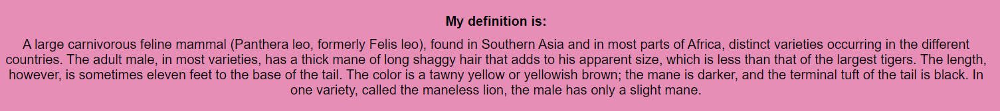

### Fetching rhyming words

Rhyming words a fetched the same way as synonyms in that an array is returned, I then needed to shuffle that array and select 10 rhyming words to display:

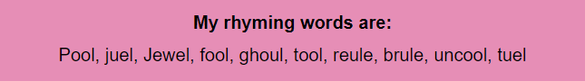

### Hint error handling

Due to relying on API calls to fetch the hints, I wanted to incorporate error handling into the game play: Rather than only logging errors to the console and alerting the player that there is an error, I have added a confirm element to each of the fetch hint functions that alerts the player of the error and asks if they want to skip the round or guess again.

If they skip, the 2nd alert displays:

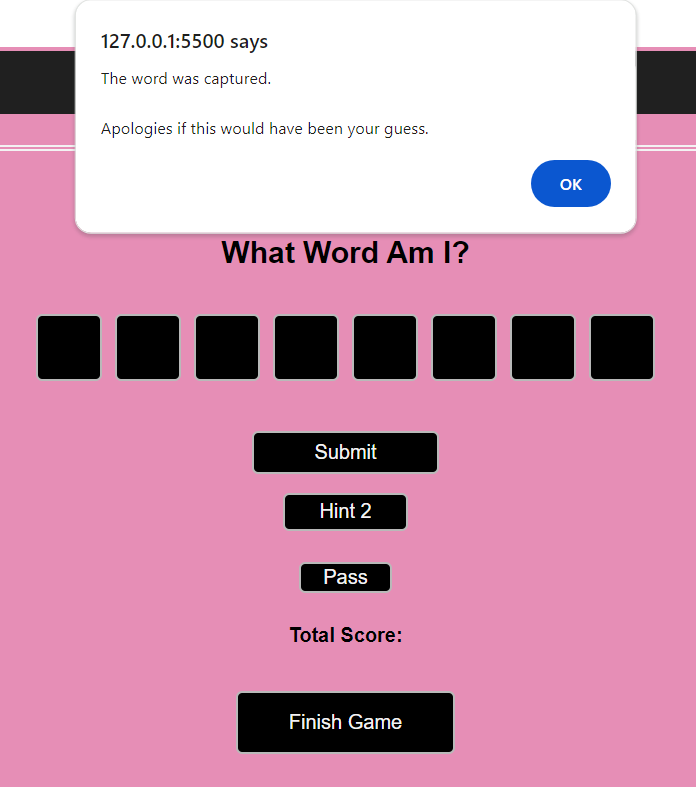

 The newRound function is called and a new word is generated and the score and score tally remain unchanged (see below example for the fetchRhymes function).

    else {
        callback("Error fetching rhymes: " + this.statusText, null);
        const skipRoundNoRhymes = confirm("We couldn't find the rhyming words for this word, apologies.\n\nWe can skip this round or you guess again.\n\nPress OK to skip or cancel to guess again");
        if (skipRoundNoRhymes) {
          alert(`The word was ${randomWord}.\n\nApologies if this would have been your guess.`);
          newRound();
        } else {
          hintButton.style.display = "block";
          hintButton.textContent = "Hint 3";
        }
    
If they choose to guess again, the hint button text reverts to it’s pre-clicked text and the player can guess again.

The player can still click the hint button and it will either display the same alert or, in the case that the reason the hint was not found was due to “too many requests”, the hint will be displayed if enough time has elapsed since they last clicked the button.

### The Hint Button

The hint button is not only WWAMI's USP, it is also crucial to the points scoring system for WWAMI. 

If the player has not clicked the hint button and submits a correct guess, they get 5 points. If they have shown 1 hint, they get 3 point. 2 hints, they get 2 points. 3 hints they get 1 point. 

How does WWAMI know how many hints have been shown. This is quite simple really and seemed like the most elegant solution - it is based on the text content of the hint button (and for only 1 point, it is based on the button being hidden). 

Each time the hint button text content updates, the points reduce and after the final hint has been shown, the button is hidden so it's clear there are no more hints available.

The text content of the button updates after displaying the hint (or reverts back if there is an error fetching the hint). 

### Submitting A Guess

When the player submits a guess, quite a few things need to happen:

* The word has to be checked to see if it matches the game word.
* If the guess is correct, the hint button text content needs to be checked to ensure the correct score message is displayed and the total score is updated.

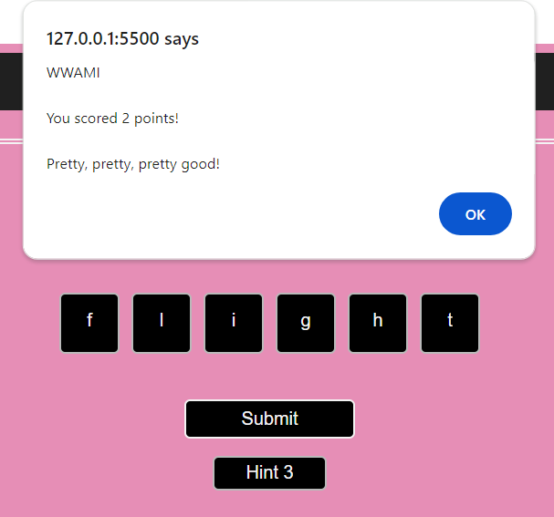

* If the guess is incorrect, the below alert shows:

Then the game resumes and any correctly guessed letters stay in place and are not editable:

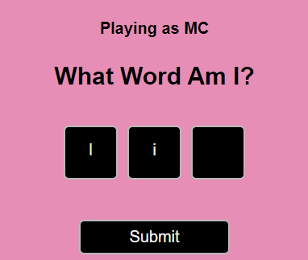

### The Pass Button

When the player clicks the pass button I wanted an alert to display, confirming if they wish to pass:

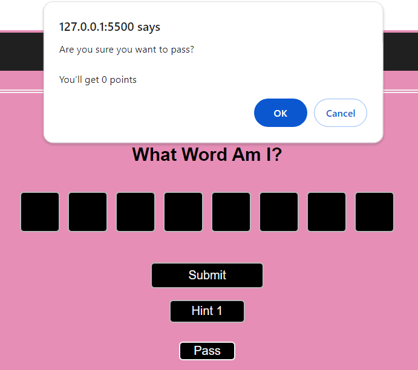

If the player clicks cancel, the game resumes. If they click pass, the below alert displays:

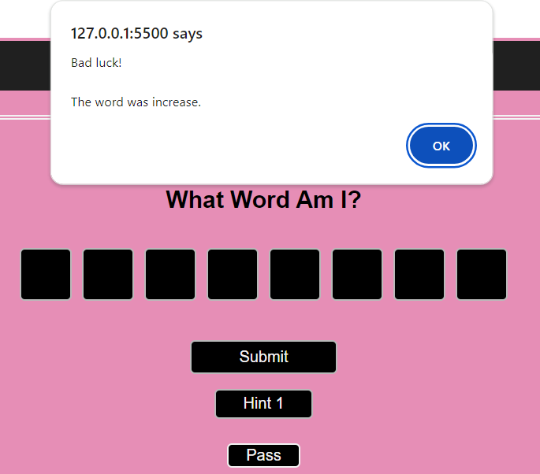

When the player clicks OK, a new round is launched, the total score updates by 0 and a score of 0 is added to the score tally.

### Emailing The Results

As there is (currently) no high scores capability, I wanted the player to be able to keep track of their scores another way.

The best solution I could implement (for now) was to have the option to email the results.

For this I have used [EmailJS](https://www.emailjs.com) 

Rather than just sending the total score by email, I wanted include a breakdown of the scores which is stored in a variable named scoreTally. 

Below shows the email that the player receives (including the nice breakdown of scores). It also includes the name they entered when starting the game.

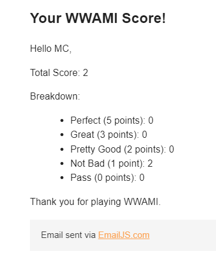

## Technologies

### Languages

HTML, CSS & JavaScript

### Frameworks, Libraries and Programs

[JQuery](https://jquery.com/) was used for the simplest event listeners (only used on the welcome page and to launch the game). JQuery would have muddied the intentions of the more complex functions so Vanilla JS was a better option for the majority of the site.

[Wordnik API](https://developer.wordnik.com/) was used to fetch the word data to be used to display hints.

[EmailJS](https://www.emailjs.com) was used to send the player their scores by email. 

As I wanted to keep the design layout simple, I did not need to use any frameworks such as Bootstrap or Tailwind to achieve the desired layout.

